# **Manuel Utilisateur : Application Arbre Généalogique**

## **Table des Matières**

- [Introduction](#introduction)  
- [Lancement de l'application](#lancement-de-lapplication)
- [Utilisation de l'application](#utilisation-de-lapplication)
  - [Création d'un arbre](#création-dun-arbre)
  - [Ajout d'un parent pour un enfant](#ajout-dun-parent-pour-un-enfant)
  - [Récupération du nombre d'ancêtres](#récupération-du-nombre-dancêtres)
  - [Récupération des Ancêtres d'une Personne](#récupération-des-ancêtres-à-partir-dune-génération)
  - [Affichage de la Famille](#affichage-de-la-famille)
  - [Suppression d'un membre et de ses ancêtres](#suppression-dun-membre-et-de-ses-ancêtres)  
  - [Récupération des membres selon leur statut parental](#récupération-des-membres-selon-leur-statut-parental)

---

## **Introduction**

L'application de gestion de l'arbre généalogique permet de créer, modifier et consulter l'arbre familial depuis un terminal. \
Elle est développée en Ada, un langage de programmation robuste et sûr. \
Ce manuel vous guidera à travers les différentes fonctionnalités de l'application et comment l'exécuter.

---

## **Lancement de l'application**  

### **Compilation**  

Depuis le répertoire /src, compilez-le code source avec GNAT :  

```bash
gnatmake main.adb
```  

Cela génère un exécutable **main**.  

### **Exécution**  

Lancez l'application avec :  

```bash
./main
```

Résultat attendu :\
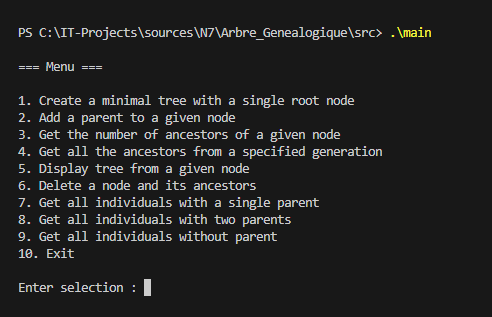  

---

## **Utilisation de l'application**

### **Création d'un arbre**

Pour commencer à utiliser les différentes interactions possibles sur un arbre généalogique, il faut pour cela créer le noeud racine de l'arbre.
Ce noeud est l'enfant symbolisant la dernière génération de la famille.\
Pour chaque création d'un membre de la famille, il faut renseigner le nom, le prénom et le sexe de la personne.\
Pour initialiser la famille, il faut saisir l'option 1 au lancement de l'application. Ensuite, il faut renseigner les informations définissant le membre.

Résultat attendu :\
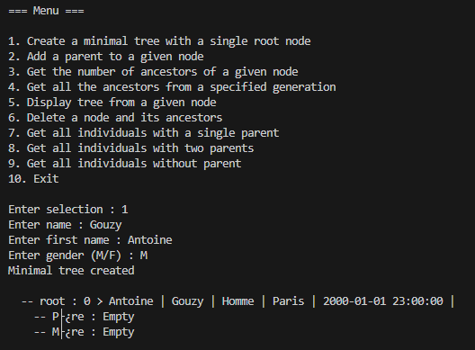

---

### **Ajout d'un parent pour un enfant**

Pour ajouter un parent à un enfant, il est nécessaire de comprendre le fonctionnement des id qui référencent les membres.\
De manière générale, la racine de l'arbre aura pour id O. Ensuite, l'id d'un membre sera généré de la façon suivante, id_enfant + 1 ou 2. 1 pour un père, 2 dans le cas d'une mère

Prenons un cas concret.\
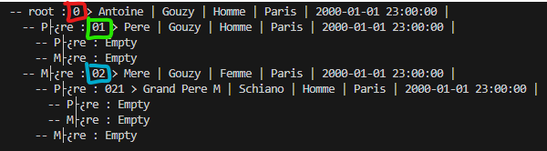\
La **racine** d'id : **0**, entourée en rouge. Le **père** (vert) a pour id **01**, et la **mère** (bleu) a pour id **02**.

Une fois l'id de l'enfant indiqué, on sélectionne le "type" de parent, père ou mère. Ensuite il faut spécifier les informations personnelles du parent comme lors de l'initialisation de la racine.

Avant l'ajout :\
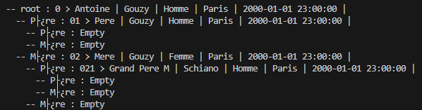

Après l'ajout (en jaune le membre ciblé par l'ajout, en bleu le nouveau membre) :\
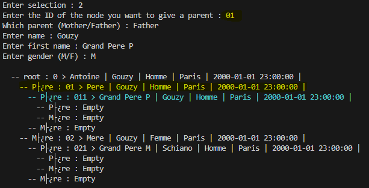

---

### **Récupération du nombre d'ancêtres**

La récupération du nombre d'ancêtres se fait à partir de l'id d'un noeud.
Le nombre correspond à la somme de tous les ancêtres à laquelle on ajoute 1 pour le noeud courant.

Par exemple, à partir de la racine, nous avons 4 (ancêtres) + 1 = 5.\
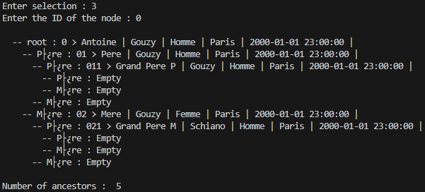

---

### **Récupération des ancêtres à partir d'une génération**

Liste tous les ancêtres à partir d'une génération, en partant de **0**, (racine de l'arbre), **1**, (les parents de la racine) ...\

Arbre exemple :\
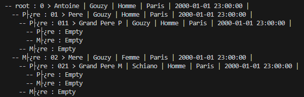

Pour une récupération de la **génération 1**, on obtient le père et la mère de la racine.\
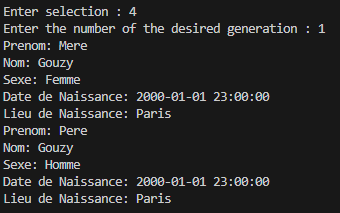

---

### **Affichage de la famille**

Affiche la famille à partir d’un membre en saisissant son identifiant.

Arbre exemple :\


Arbre obtenu :\
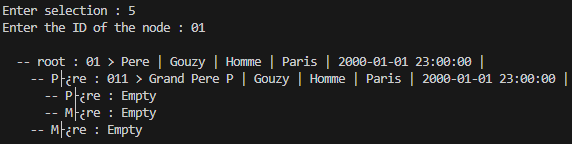

---

### **Suppression d'un membre et de ses ancêtres**

Supprime un membre et tous ses ancêtres à partir de son identifiant.  

Arbre exemple :\


Arbre obtenu après la suppression du noeud "01":\
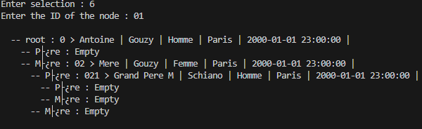

---

### **Récupération des membres selon leur statut parental**

Affiche les membres en fonction de leur nombre de parents.\
Trois choix sont disponibles:

- Option 1 : Récupération des membres avec un parent
- Option 2 : Récupération des membres avec deux parents
- Option 3 : Récupération des membres orphelins

Arbre exemple :\


#### **Récupération des membres avec un parent**

Pour obtenir les membres avec un parent unique, il faut choisir l'**option 7** du menu.\
Résultat obtenu :\
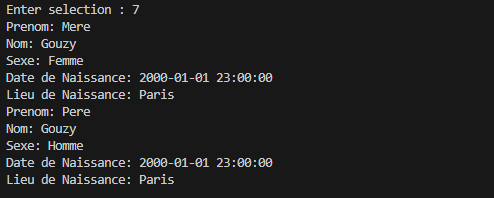

#### **Récupération des membres avec deux parents**

Pour obtenir les membres avec un parent unique, il faut choisir l'**option 8** du menu.\
Résultat obtenu :\
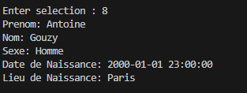

#### **Récupération des membres orphelins**

Pour obtenir les membres avec un parent unique, il faut choisir l'**option 9** du menu.\
Résultat obtenu :\
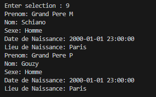
