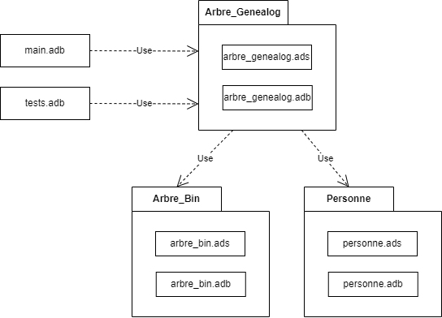

# Arbre Généalogique

## I - Résumé  

Le projet a pour objectif de concevoir et développer une application de gestion d’arbre généalogique en utilisant le langage Ada. L’objectif principal est de modéliser avec précision les relations familiales en s’appuyant sur des structures de données adaptées, tout en offrant des fonctionnalités interactives permettant de manipuler l’arbre généalogique.

Une particularité essentielle du projet réside dans la contrainte selon laquelle l’arbre généalogique ne contient que des **enfants uniques**. Ainsi, aucune fratrie n’est autorisée, ce qui simplifie la structure des relations parent-enfant.  

Ce rapport détaille l’ensemble des aspects techniques et méthodologiques liés au développement de l’application. Il aborde :  

- **L’architecture de l’application**, incluant la structure globale du programme, les modules ou composants développés, et leurs interactions.  
- **Les choix techniques**, en justifiant les décisions liées aux technologies, outils, bibliothèques et paradigmes de programmation utilisés.  
- **Les algorithmes et structures de données**, en décrivant leur conception et leur rôle dans la manipulation des relations familiales.  
- **La démarche de test et validation**, mettant en avant les méthodes utilisées pour vérifier le bon fonctionnement du programme, notamment les cas de test, la couverture fonctionnelle et les outils associés.  
- **Les difficultés rencontrées**, en expliquant les défis survenus au cours du développement et les solutions mises en œuvre pour y remédier.  
- **Les perspectives d’évolution**, en proposant des axes d’amélioration futurs, comme l’ajout de nouvelles fonctionnalités, l’optimisation des performances ou des révisions partielles de certains composants.  

Ce projet ambitionne de fournir une interface intuitive et efficace pour construire, explorer et modifier un arbre généalogique tout en respectant la contrainte d’unicité des enfants, et ce rapport constitue une base solide pour son développement et ses futures évolutions.  

## II - Introduction  

La gestion des arbres généalogiques constitue un défi à la fois technique et conceptuel, nécessitant une modélisation rigoureuse des relations familiales. Ce projet s’inscrit dans cette optique et propose le développement d’une application en **Ada** permettant de représenter, manipuler et explorer un arbre généalogique tout en respectant une contrainte particulière : chaque individu est un **enfant unique**, ce qui interdit la présence de fratries dans la structure.  

L’objectif principal du projet est de fournir une solution informatique robuste et interactive permettant d’ajouter, de modifier ou de supprimer des individus et des relations dans l’arbre. Cette application, en plus d’offrir des fonctionnalités essentielles de gestion, met l’accent sur des principes fondamentaux tels que l’efficacité des algorithmes, la lisibilité du code et la modularité.  

Le présent rapport est structuré comme suit :  

1. **Résumé** : Rappel des objectifs et contenu du rapport.  
2. **Architecture de l’application** : Description des différents modules et leur rôle respectif dans la construction de l’application.  
3. **Principaux choix réalisés** : Analyse des décisions techniques et méthodologiques, notamment les outils et paradigmes utilisés.  
4. **Algorithmes et types de données** : Présentation détaillée des mécanismes mis en œuvre pour représenter les individus et leurs relations, ainsi que les algorithmes associés.  
5. **Démarche de test** : Approche adoptée pour valider le bon fonctionnement du programme, incluant les outils et stratégies de test.  
6. **Difficultés et solutions** : Retour sur les principaux obstacles rencontrés et les solutions envisagées ou implémentées, avec justification des choix retenus.  
7. **Bilan technique** : État d’avancement global du projet, incluant une réflexion sur les perspectives d’évolution et d’amélioration.  
8. **Bilan personnel et du binôme** : Analyse des apports individuels et collectifs, répartition des tâches, leçons tirées du projet et évaluation du temps passé sur les différentes étapes.  

## III - Architecture de l'application  

L’application repose sur une architecture modulaire organisée autour du répertoire principal `src`, qui contient l’ensemble des fichiers sources nécessaires au fonctionnement du programme. Chaque module y joue un rôle spécifique dans la gestion et la manipulation de l’arbre généalogique.  

### Structure et rôle des principaux modules

#### 1. **`main.adb`**  
Le fichier `main.adb` constitue le point d’entrée de l’application. Il intègre un menu interactif qui permet à l’utilisateur d’accéder et d’utiliser les fonctionnalités développées dans les autres modules. Ce menu offre une interface simplifiée pour interagir avec l’arbre généalogique, comme l’ajout ou la suppression d’individus, la modification des relations, et l’affichage de l’arbre, tout en orchestrant l’exécution globale du programme.  

#### 2. **`personne`**  
Le module `personne` se charge de la représentation des individus dans l’arbre généalogique. Il définit leurs attributs principaux (par exemple, nom, prénom, date de naissance) et fournit des sous-programmes pour créer, modifier, afficher et manipuler ces données.  

- **Interface (`personne.ads`)** : Définit les types et sous-programmes accessibles aux autres modules.  
- **Implémentation (`personne.adb`)** : Contient les détails des algorithmes associés aux manipulations des données individuelles.  

#### 3. **`arbre_bin`**  
Ce module implémente les structures de données et les algorithmes fondamentaux pour manipuler des arbres binaires. Il s’agit de la base technique sur laquelle repose l’arbre généalogique, avec des fonctionnalités telles que :  
- L’ajout et la suppression de nœuds.  
- Les parcours d’arbre.  
- Les recherches dans l’arbre.  

- **Interface (`arbre_bin.ads`)** : Spécifie les structures et fonctions de base pour les arbres binaires.  
- **Implémentation (`arbre_bin.adb`)** : Fournit les détails de l’implémentation des algorithmes.  

#### 4. **`arbre_genealog`**  
Construit sur `arbre_bin`, ce module est spécifique à la gestion des relations familiales dans le cadre de l’arbre généalogique. Il permet de modéliser et de manipuler les relations parent-enfant.  

- **Interface (`arbre_genealog.ads`)** : Définit les opérations spécifiques à l’arbre généalogique, telles que l’ajout d’un parent.  
- **Implémentation (`arbre_genealog.adb`)** : Détaille les algorithmes permettant de gérer les relations généalogiques.  

#### 5. **`tests`**  
Le module `tests` regroupe les tests unitaires et d’intégration conçus pour valider le bon fonctionnement des différentes parties du programme.  

- **Implémentation (`tests.adb`)** : Contient les scénarios de test et leurs résultats attendus.  

### Synthèse de l'architecture  

Chaque module de l’application est conçu pour remplir une tâche précise, en séparant les responsabilités selon le principe de modularité. Cette organisation permet de rendre le code plus lisible, plus maintenable et plus facile à faire évoluer. L’utilisation de modules indépendants facilite également les tests et la détection d’éventuels dysfonctionnements.

## IV - Principaux choix réalisés  

Dans le cadre du développement de notre application de gestion d’arbre généalogique, plusieurs choix techniques ont été faits afin d’assurer à la fois la flexibilité et l’efficacité de la structure de données utilisée.  

### 1. Utilisation des `access String`  
Nous avons opté pour l’utilisation de **pointeurs (`access String`)** dans le module `arbre_genealog` afin de gérer dynamiquement les informations stockées, notamment les noms des individus. Cette approche permet d’adapter la mémoire allouée en fonction des besoins réels, évitant ainsi les limitations des tableaux statiques et optimisant la gestion des tailles variables des chaînes de caractères.  

### 2. Structure de l’arbre généalogique  
Notre modèle d’arbre généalogique repose sur une **chaîne de nœuds** où chaque individu est représenté par un élément contenant deux références (`parent1` et `parent2`). Ce choix nous permet de construire des arbres sur mesure, en connectant chaque individu directement à ses ascendants sans imposer de structure rigide. Cette flexibilité est essentielle pour modéliser différentes configurations familiales et assurer une représentation claire des liens de parenté.  

Ce modèle facilite également les opérations de modification, telles que l’ajout ou la suppression d’individus, en mettant à jour les références parentales sans nécessiter de réorganisation complexe de l’ensemble de l’arbre.

### 3. Génération des IDs
Afin de faciliter le parcours de l'arbre, les IDs sont générés automatiquement de la façon suivante : 
- 0 pour la racine
- ID de l'enfant suivi de 1 pour un parent gauche (père)
- ID de l'enfant suivi de 2 pour un parent droit (mère)

### 4. Nom et prénom pouvant être vides
Afin de permettre d'entrer des personnes partiellement connues dans l'arbre, le nom et le prénom peuvent être laissés vides (chaîne vide).

### 5. Simplification de la saisie
Dans le main, les dates de naissance et de décès ainsi que les ville de naissance sont saisies automatiquement afin de faciliter la création de nouvelles personnes.

## V - Algorithmes et types de données  

### 1. **Types de données utilisés**  

L'architecture de l'application repose sur des **enregistrements (`record`)**, des **pointeurs (`access`)**, ainsi qu'un arbre binaire pour modéliser les relations de parenté.  

- **Type `T_Arbre_Personnes`** : dérivé de `T_Arbre`, il représente l'arbre généalogique, chaque nœud contenant une personne et des références vers ses parents.  
- **Type `Ancestor_List`** : liste dynamique contenant une collection d'ancêtres, utilisée pour extraire les générations d’individus et analyser l’arbre.  

### 2. **Principaux algorithmes implémentés**  

#### a) **Création de l’arbre généalogique**  
- `Create_Family_Tree(Root : in out T_Arbre_Personnes; Root_Value : Personne.T_Personne)`:  
  Initialise un arbre avec un individu racine et construit progressivement les relations parentales.  

#### b) **Affichage de l’arbre**  
- `Display_Family_Tree(Tree : in T_Arbre_Personnes)`:  
  Affiche l’arbre généalogique en parcourant récursivement les nœuds.  
- `Display_Family_Tree_From_Node(Tree : in T_Arbre_Personnes; Id_Node: String)`:  
  Affiche l’arbre en partant d’un individu donné.  

#### c) **Ajout d’un parent**  
- `Add_Father (Tree : in out T_Arbre_Personnes; Value: Personne.T_Personne)`:  
  Ajoute un père à la racine de l’arbre.  
- `Add_Mother (Tree : in out T_Arbre_Personnes; Value: Personne.T_Personne)`:  
  Ajoute une mère à la racine de l’arbre.  
- `Add_Father (Tree : in out T_Arbre_Personnes; Value: Personne.T_Personne; Id_Child: String)`:  
  Permet d’ajouter un père à un individu spécifique identifié par `ID_Enfant`.  
- `Add_Mother (Tree : in out T_Arbre_Personnes; Value: Personne.T_Personne; Id_Child: String)`:  
  Permet d’ajouter une mère à un individu spécifique identifié par `ID_Enfant`. 

#### d) **Accès aux parents et enfants**  
- `Get_Father (Tree : in T_Arbre_Personnes) return T_Arbre_Personnes;`:  
  Retourne le père d’un individu.  
- `Get_Mother (Tree : in T_Arbre_Personnes) return T_Arbre_Personnes;`:  
  Retourne  la mère d’un individu.  
- `Get_Child(Tree: in T_Arbre_Personnes; Id_Node : in String)`:  
  Permet d’obtenir les enfants d’un individu donné, sous réserve d’un `ID_Noed` valide.  

#### e) **Suppression d’un membre de la famille**  
- `Remove_Family_Member(Tree: in out T_Arbre_Personnes; Id_Node: in String)`:  
  Supprime un individu et réorganise l’arbre pour maintenir la structure.  
- `Remove_Father(Child: in out T_Arbre_Personnes)`:  
  Supprime respectivement le père ou la mère d’un individu donné.  

#### f) **Analyse de l’arbre généalogique**  
- `Count_Ancestors(Tree: in T_Arbre_Personnes; Id_Node : in String)`:  
  Calcule le nombre total d’ancêtres d’un individu.  
- `Get_Ancestors_Generation (Tree : in T_Arbre_Personnes; Generation: Integer)`:  
  Retourne tous les ancêtres d’une génération spécifique.  
- `Nodes_With_Two_Parents(Tree : in T_Arbre_Personnes)`, `Nodes_With_Only_One_Parent(Tree : in T_Arbre_Personnes)`, `Nodes_Without_Parent(Tree : in T_Arbre_Personnes)`:  
  Renvoie respectivement les individus ayant deux parents, un seul parent ou aucun parent.  
- `Has_Two_Parents(Tree : in T_Arbre_Personnes)`, `Has_Only_One_Parent(Tree : in T_Arbre_Personnes)`, `Is_Orphan(Tree : in T_Arbre_Personnes)`:  
  Vérifie le statut parental d’un individu.  

#### g) **Profondeur et structure de l’arbre**  
- `Get_Tree_Depth(Tree: in T_Arbre_Personnes)`:  
  Calcule la profondeur de l’arbre, utile pour évaluer le nombre de générations présentes.  

Ces algorithmes assurent une manipulation efficace des données généalogiques, garantissant cohérence et intégrité des relations parentales dans l’arbre.

## VI - Tests

### 1. Objectifs des tests
L'objectif des tests est de valider le bon fonctionnement de la gestion de l'arbre généalogique, en s'assurant que les différentes opérations de création, ajout, suppression et récupération des données sont correctement implémentées.

### 2. Scénarios de test
Plusieurs scénarios ont été définis pour vérifier le comportement du programme :

#### a) Création d'un arbre généalogique minimal
Un premier test consiste à créer un arbre généalogique contenant un seul individu et à vérifier que les informations sont correctement stockées.

#### b) Ajout de parents
Un second test valide l'ajout de parents à un individu existant. Il permet de s'assurer que les liens parent-enfant sont bien établis et que la structure de l'arbre est cohérente.

#### c) Récupération des ancêtres
Des tests sont effectués pour récupérer les ancêtres d'un individu sur plusieurs générations. L'objectif est de s'assurer que les données sont correctement remontées et structurées sous forme de tableau.

#### d) Gestion des identifiants
Les identifiants uniques des individus sont testés afin de garantir leur bon fonctionnement lors des opérations de récupération et d'ajout de nouveaux membres à l'arbre.

### 3. Résultats des tests
Les tests ont été exécutés sur plusieurs jeux de données et ont permis de vérifier que :
- La création d'un arbre minimal fonctionne sans erreur.
- L'ajout de parents met bien à jour la structure de l'arbre.
- La récupération des ancêtres renvoie les bonnes informations.
- Les identifiants permettent un accès correct aux individus.
- Suppression d’un individu et réorganisation de l’arbre.

## VII - Difficultés et solutions

### Difficultés

- **Utilisation du langage Ada** : La principale difficulté a résidé dans l’utilisation du langage Ada, notamment en raison de ses types fortement typés et de ses règles strictes de gestion de la mémoire. Cela a complexifié la gestion dynamique des données et l'implémentation d'algorithmes complexes nécessaires pour l’arbre généalogique.

### Solutions

- Pour surmonter ces défis, des stratégies ont été mises en place pour utiliser de manière optimale les structures de données d'Ada, en tirant parti de sa gestion mémoire stricte tout en conservant la flexibilité nécessaire pour manipuler un arbre généalogique complexe. Des fonctions spécifiques ont également été développées pour gérer les types de données de manière sûre et efficace, assurant ainsi une gestion sans erreur de l’arbre.

### 1. **Bilan technique :**

#### a) **État d’avancement du projet :**

Le projet a atteint un bon niveau d’avancement à ce stade, avec la mise en œuvre de la plupart des fonctionnalités principales. Nous avons réussi à implémenter les fonctionnalités essentielles, et un certain nombre de tests ont été effectués pour assurer la stabilité et la robustesse de notre système. Cependant, des améliorations doivent encore être apportées, notamment concernant la gestion des exceptions ADA et la validation des types de données.

- **Gestion des exceptions ADA** : Un aspect clé du projet a été de garantir une gestion complète et robuste des exceptions ADA. À ce jour, certaines exceptions sont encore partiellement couvertes, et il reste des cas particuliers à gérer, en particulier dans les échanges entre modules. Nous prévoyons de réévaluer la structure de gestion des erreurs pour inclure tous les cas d'exception possibles et assurer une meilleure résilience du système.

- **Types de données** : Nous avons rencontré quelques défis dans la gestion des types de données, notamment pour assurer la cohérence et éviter les erreurs de conversion de types. Certains types de données doivent être mieux définis et validés tout au long du projet afin d'éviter les erreurs potentielles liées à des manipulations incorrectes.

#### b) **Perspectives d’amélioration :**

Les améliorations futures se concentreront sur deux axes principaux : l’optimisation de la gestion des exceptions ADA et la validation stricte des types de données.

- **Amélioration de la gestion des exceptions ADA** : Afin de garantir une gestion d’erreurs robuste, nous devrons mettre en place des exceptions personnalisées et affiner la gestion des erreurs dans toutes les fonctionnalités du projet.

- **Validation des types de données** : Pour éviter des erreurs de conversion et garantir la fiabilité des traitements, il est nécessaire de renforcer la validation des types de données, peut-être en adoptant des outils permettant de mieux gérer la cohérence entre les différentes parties du projet.

#### c) **Répartition du travail au sein du binôme :**

La répartition des tâches s'est faite de manière fonctionnelle, chaque membre prenant en charge des parties spécifiques du projet en fonction de ses compétences. Cela a permis d’optimiser la réalisation des différentes fonctionnalités et d’assurer que chaque module soit traité de manière cohérente.

Nous avons partagé la rédaction du rapport, chaque membre ayant rédigé une partie spécifique liée à ses contributions techniques. Les tâches ont été régulièrement vérifiées en commun, afin de nous assurer que les fonctionnalités étaient bien intégrées et que nous pouvions corriger rapidement les problèmes rencontrés.

Le projet représente plus de 70 heures/homme de travail, avec une répartition équilibrée du temps entre les deux membres du binôme. Le temps passé à chaque phase du projet est détaillé ci-dessous.

### 2. **Bilan personnel et du binôme :**

#### a) **Bilan personnel :**

Ce projet a été une expérience très enrichissante, tant sur le plan technique qu’organisationnel.

- **Intérêt du projet** : Nous avons particulièrement apprécié le défi technique que représente la gestion des exceptions et des types de données, qui ont nécessité une réflexion approfondie et une attention aux détails pour garantir la stabilité du système.
  
- **Difficulté à évaluer le temps passé** : Une difficulté notoire a été d’évaluer précisément le temps consacré à chaque tâche. Certaines étapes se sont avérées plus complexes que prévu, ce qui a conduit à une estimation du temps de travail souvent sous-évaluée. La gestion des erreurs et la validation des types de données ont notamment pris plus de temps que prévu.

- **Temps consacré à la conception, l’implantation, la mise au point et au rapport** :

  - **Conception** : La phase de conception a été cruciale pour poser les bases du projet, en particulier en ce qui concerne la gestion des exceptions et la définition des types de données. Elle a représenté environ 15% du temps total du projet.
  
  - **Implantation** : La phase d’implantation a été consacrée principalement à la réalisation du code, et elle a pris environ 30% du temps total. La définition des algorithmes et leur intégration avec les autres modules ont été les étapes clés.
  
  - **Mise au point** : La mise au point a été la partie la plus chronophage, avec près de 40% du temps total consacré à tester et ajuster les différents modules, en particulier pour la gestion des exceptions et la validation des types de données.
  
  - **Rédaction du rapport** : La rédaction des rapports a pris environ 15% du temps total, chaque membre rédigeant une partie correspondant à ses responsabilités. Cela a permis de bien formaliser les choix techniques et de rendre compte de l’avancement du projet.

#### b) **Bilan du binôme :**

Le travail en binôme a été très positif et a permis d'atteindre de bons résultats en termes de collaboration et de productivité.

- **Répartition des tâches** : La répartition des tâches a été effectuée fonction par fonction, ce qui a permis à chaque membre de se concentrer sur un domaine particulier tout en assurant une bonne cohérence technique. Nous avons régulièrement échangé pour résoudre les problèmes rencontrés et nous assurer que nos solutions étaient compatibles.

- **Temps passé à la conception, implantation, mise au point et rapport** : Le temps total de travail a été réparti de manière équilibrée, avec une attention particulière accordée à chaque phase clé (conception, implantation, mise au point et rapport). 

  - **Conception :** 25%
  - **Implantation :** 35%
  - **Mise au point :** 30%
  - **Rapport :** 10%

- **Enseignements tirés** : Nous avons appris l'importance d’une bonne gestion du temps et de la collaboration. Bien que la répartition des tâches ait été équilibrée, nous avons constaté qu'il était difficile de prédire exactement combien de temps chaque fonctionnalité prendrait en raison des défis imprévus. De plus, l’importance de la gestion des exceptions et des types de données s’est avérée plus grande que prévu.

- **Difficultés rencontrées** : La principale difficulté a été la gestion des exceptions ADA et la validation des types de données, qui ont nécessité des ajustements fréquents et des tests approfondis. Les problèmes d’intégration entre les modules ont également retardé certaines étapes.